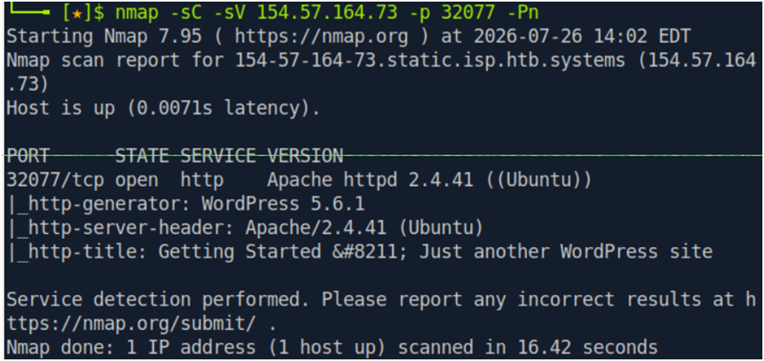

# Hack The Box Academy: Public Exploits Writeup

| **Модуль** | Getting Started  |
| :--- | :--- |
| **Тема** | Public Exploits |
| **Сложность** | Easy (Лёгкий) |
| **Вектор атаки** | Web / WordPress Plugin Exploitation |
| **Уязвимость** | CVE-2015-10134 (Path Traversal) |
| **ОС** | Web-based Parrot Linux (Pwnbox) |

---

## 1. Сбор информации (Reconnaissance)

### Сканирование портов
Первоначальное сканирование с помощью nmap не дало результатов — вероятно, из-за нестабильного сетевого соединения или ограничений целевой машины (хост блокировал ICMP-запросы). Повторим попытку, используя флаг -Pn.

```bash
nmap -sV -sC  154.57.164.73 -p 32077 -Pn
```

 
###	Перебор директорий 

Проведем перебор директорий с помощью gobuster:

```bash
gobuster dir -u http://154.57.164.73:32077 --wordlist /usr/share/dirb/wordlists/common.txt
```

В ходе перебора была найдена директория /wp-included, содержащая множество стандартных конфигурационных файлов. Но в поиске флага они не нашли применения.

Откроем целевой IP-адрес http://154.57.164.73:32077 в *браузере*. На сайте указан установленный плагин Simple Backup Plugin 2.7.10 для WordPress.

**Результаты сканирования:**
* **Порт:** `32077/tcp` (Apache 2.4.41 Ubuntu)
* **CMS:** WordPress 5.6.1
* **Найденный компонент:** `Simple Backup Plugin 2.7.10`

---

## 2. Поиск эксплойта и использование уязвимости

Исследуем уязвимости `WordPress 5.6.1` и `Simple Backup Plugin 2.7.10` через searchsploit, WPScan.
Поиск информации в интернете о `Simple Backup Plugin 2.7.10` выявил критическую уязвимость CVE-2015-10134:

`Simple Backup <= 2.7.10 - Arbitrary File Download via Path Traversal`

Эта уязвимость (типа Path Traversal) позволяет осуществлять произвольное чтение файлов (Arbitrary File Download).

На github найден готовый модуль для Metasploit Framework: `wp_simple_backup_file_read.rb`:

https://github.com/rapid7/metasploit-framework/blob/79a6d23d6f547b931bf87d26394787011e878b8c/modules/auxiliary/scanner/http/wp_simple_backup_file_read.rb

Запустим msfconsole в терминале и настроим модуль:


---

## Результаты выполнения и флаг

Файл найден и скачан во внутреннюю директорию loot. Откроем и прочитаем его с помощью команды:

`cat [...]_055241.txt`

В файле содержится флаг вида:

`HTB{my_***_***}`
